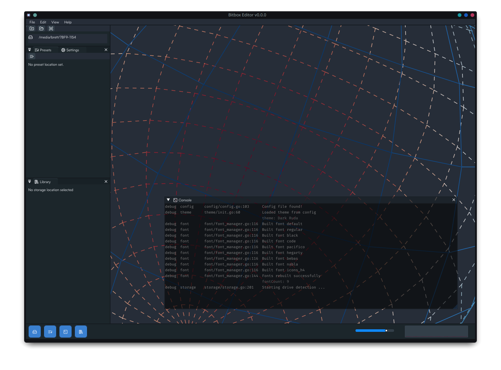
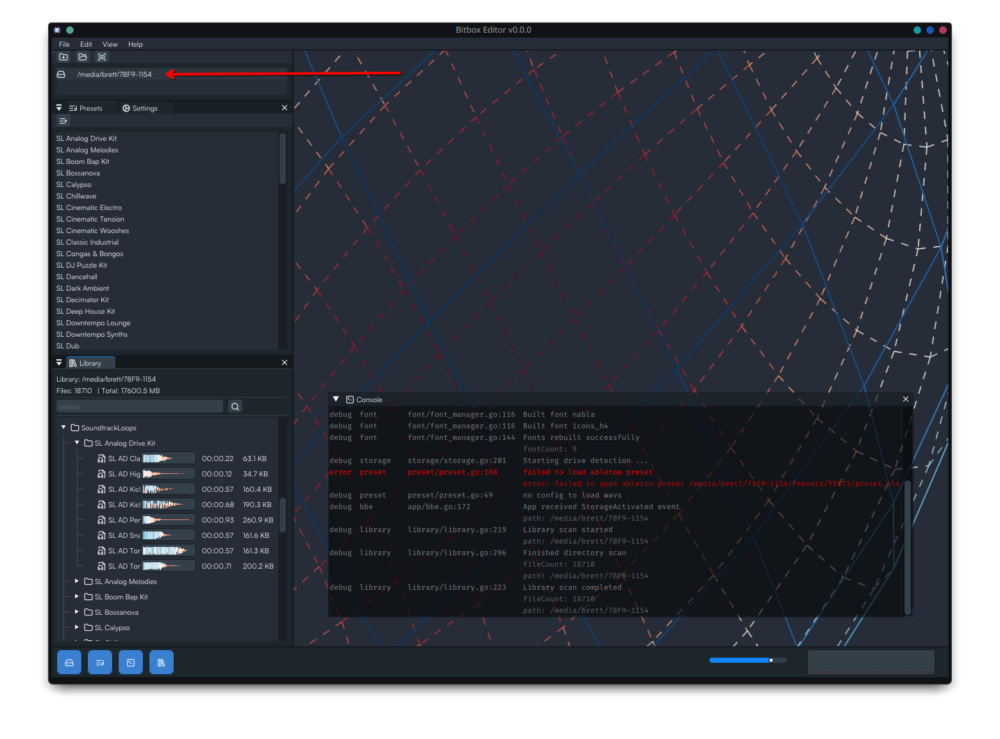
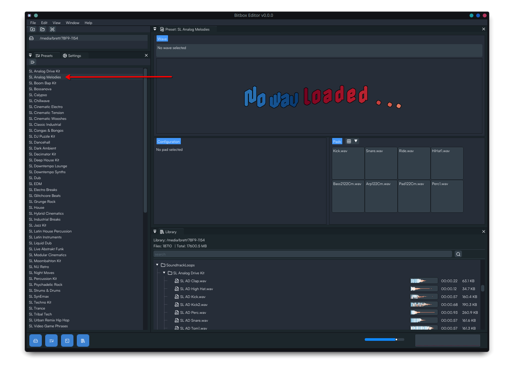
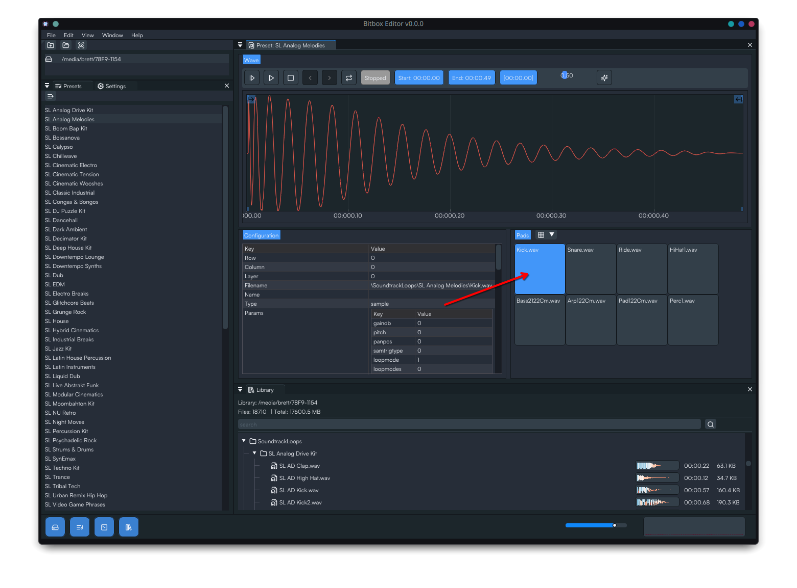

# Bitbox-Editor (WIP)
Desktop editor for 1010Music Bitbox users.

# Dev Updates (2025-11-17)

#### App Startup

#### Bitbox SD media location (and custom locations coming soon)

#### Double click presets to load one or more at a time

#### Click a pad to begin editing. Playback starts automatically.

#### Waveform interaction 
https://github.com/user-attachments/assets/fe41583c-b650-4d96-941c-4b052e99d99c

#### Theme & Colormap Settings
https://github.com/user-attachments/assets/9039840b-b015-4c07-93fe-33946cb2262d

https://github.com/user-attachments/assets/17dbba54-203e-40f1-ac23-645622163670

#### Edit Multiple Presets & Window Docking
https://github.com/user-attachments/assets/d4922c30-ff65-4f2e-8285-805a8957fc43
