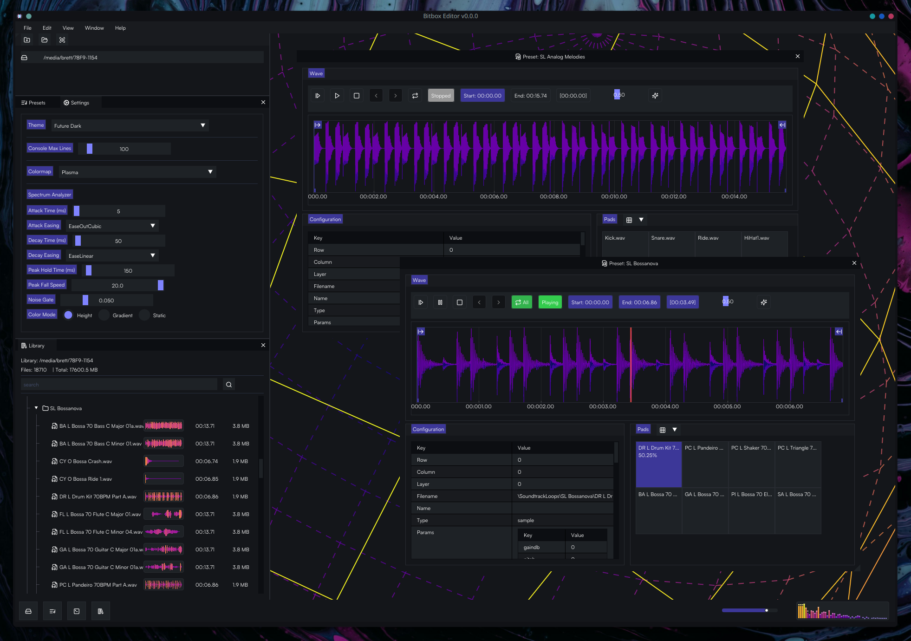
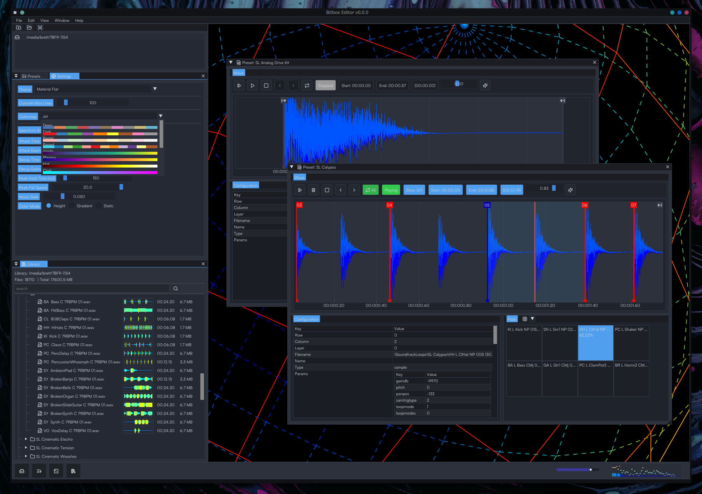
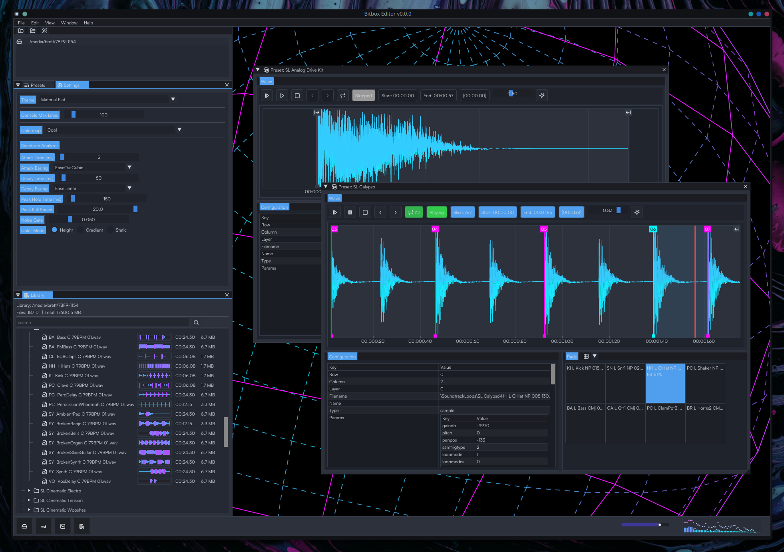

# Bitbox-Editor (WIP)
Desktop editor for 1010Music Bitbox users.

# Dev Updates (2025-11-17)

#### App Startup

#### Bitbox SD media location (and custom locations coming soon)

#### Double click presets to load one or more at a time

#### Click a pad to begin editing. Playback starts automatically.

#### Waveform interaction 
<video width="640" controls>
    <source src="https://bronson.zip/content/media/2025/11/2025-11-17-03-59-15.mp4" type="video/mp4">
</video>

#### Settings

